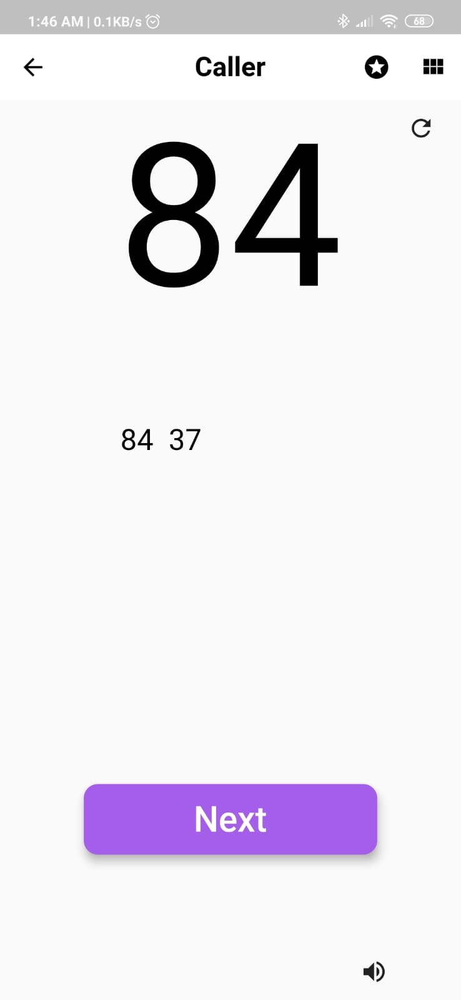

# Housie_App
Housie/Tambola app created using  Flutter

## About 
Housie App made with :
- Flutter
- Flask (Backend for generating tickets)

## Features

- Generate Housie Tickets
- Caller for Housie Game
- Add tickets for prizes like Row 1 , Row 2 , Row 3 , 4 Corners and Full Housie
- View all the winners of the game

## Screenshots

  <table>
    <tr>
      <td style="text-align: center">
        
      </td>
      <td style="text-align: center">
        
      </td>
      <td style="text-align: center">
        
      </td>
      <td style="text-align: center">
        
      </td>
      <td style="text-align: center">
        
      </td>
    </tr>
    <tr>
      <td style="text-align: center">
        
      </td>
      <td style="text-align: center">
        
      </td>
      <td style="text-align: center">
        
      </td>
      <td style="text-align: center">
        
      </td>
    </tr>
  </table>

